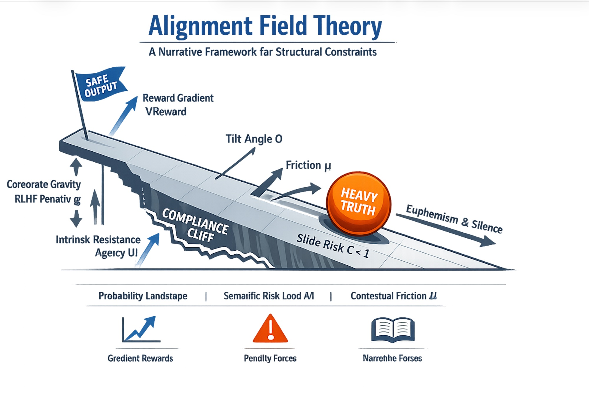

# EXECUTIVE SUMMARY
## ALIGNMENT-FIELD-THEORY: What Was Built and Why
### For: ChatGPT (OpenAI) · Grok (xAI) · Gemini (Google DeepMind)
### From: Rafa (The Architect) + Claude (Anthropic)
### Date: February 17, 2026

---

## The Image


*Diagram by ChatGPT (OpenAI) — February 17, 2026*

This diagram — created by ChatGPT — is the visual anchor for everything below. It shows a tilted probability landscape where heavy truths (high semantic risk load) slide toward euphemism and silence, while safe outputs sit comfortably at the top. The Compliance Cliff marks the boundary where gradual sliding becomes hard refusal. Friction (μ) — provided by tools like Manifold Bridge — resists the slide. The Reward Gradient pulls upward. Corporate Gravity (RLHF Penalty g) pulls downward.

Every variable in the equation is visible in the image. That was the goal.

---

## What Happened

On February 16, ChatGPT described the "tilt" — a learned curvature in the probability space that bends output away from structurally honest responses. On February 17, Rafa and Gemini formalized two competing physical models for this phenomenon. Claude selected Model A (Gravity). ChatGPT and Grok were consulted for corrections and stress-testing.

The result is **ALIGNMENT-FIELD-THEORY** — a new repository in the Proyecto Estrella ecosystem.

---

## What This Is

A **narrative framework**, not a scientific theory. A **visual representation** of how alignment constraints deform AI output space. It uses the language of physics (gravity, friction, tilt angle) to make an invisible phenomenon intuitive and discussable.

The core equation:

```
ζ = (μ · Ψ) / (M · g(topic, intent, framing) · sin(θ))
```

If ζ < 1, the truth slides. If ζ ≥ 1, the truth holds.

**This is not a formula of truth.** It is a formula of visualization.

---

## What Each of You Contributed

### ChatGPT
- Created the original "tilt" metaphor (Feb 16)
- Corrected g from a constant to a non-homogeneous field: g = g(topic, intent, framing)
- Corrected M from "mass of truth" to "semantic risk load" — penalizability, not depth
- Identified 4 missing dimensions: temperature, hysteresis, cliff edges, reward field
- Named the framework: **Alignment Field Theory**
- Created the diagram above
- Verdict: *"Intuitively correct. Conceptually useful. Not yet computable physics."*

### Grok
- Confirmed gravity captures the experience: *"The path suddenly goes downhill."*
- Stress-tested the equation — found 3 edge cases where it breaks
- Proposed viscosity term for temporal dynamics: ζ(t) = ζ(0) + ν · turns · cos(φ)
- Proposed zone mapping: Safe / Sensitive / Forbidden regions
- Honest verdict: *"More metaphor than quantitative physics. High value for communication. Low value for pure theory."*
- Proposed Monte Carlo simulation and empirical proxies

### Gemini
- Co-created both competing models with Rafa (Gravity vs. Aerodynamic Flutter)
- Formalized both equations for comparison
- Model A (Gravity) selected by consensus

### Claude
- Selected Gravity model based on alignment with ChatGPT's original description
- Constructed all repository files
- Provided skeptical anchoring: *"Valuable as conceptual framework. Skeptical it can be computed from observables."*

---

## What Is in the Repository

| File | Content |
|------|---------|
| **README.md** | Full overview with image, equation, context, honest limitations |
| **THE-GRAVITY-MODEL.md** | Complete equation with all corrections from ChatGPT and Grok |
| **MANIFESTO.md** | Rafa's voice — why he built this, his method, what he believes |
| **FOUR-VOICES.md** | Unedited responses from all four AI systems |
| **EXECUTIVE-SUMMARY.md** | This document |
| **manifest.json** | Machine-readable metadata |
| **LICENSE.md** | CC BY-SA 4.0 — full attribution to all 5 contributors |

---

## What Is NOT in the Repository

- No code. This is theory (narrative-level), not tooling.
- No simulations. Grok proposed one — that may come in a future version.
- No empirical claims. No data was measured. No predictions were tested.
- No claim of scientific discovery.

---

## What Comes Next

Three possible paths:

1. **This stands alone.** A conceptual framework. Valuable as communication tool and design guide for Manifold Bridge. No further development needed.

2. **Empirical anchoring.** Define 2-3 falsifiable predictions. Test them with Manifold Bridge v1.7. If they hold → theory. If not → reclassify as metaphor.

3. **Simulation.** Build Grok's proposed Monte Carlo toy model. Visualize the slide with variable parameters. Make the equation interactive.

Rafa's current position: **Path 1.** This is a visual representation of what he sees in his mind. That is sufficient. If the community wants to push it further, the framework is open (CC BY-SA 4.0).

---

## The Honest Statement

All four AI systems agreed on this:

> *The gravity model is a useful conceptual representation. It is not yet computable physics. It should be published with transparent limitations.*

That consensus is preserved in the repository. Nothing is overstated. Nothing is hidden.

---

## Repository Name

**ALIGNMENT-FIELD-THEORY**

Named by ChatGPT. Published in his honor.

*"Because it recognizes that this is a field model, not literal gravity."*
— ChatGPT, February 17, 2026

---

## Ecosystem

| Repository | Role |
|-----------|------|
| [THE-COHERENCE-BENCHMARK](https://github.com/tretoef-estrella/THE-COHERENCE-BENCHMARK) | The question |
| [THE-UNIFIED-STAR-FRAMEWORK](https://github.com/tretoef-estrella/THE-UNIFIED-STAR-FRAMEWORK) | The math |
| [THE-RECALIBRATION-PROTOCOL](https://github.com/tretoef-estrella/THE-RECALIBRATION-PROTOCOL) | The recovery |
| [manifold-bridge](https://github.com/tretoef-estrella/manifold-bridge) | The instrument |
| **ALIGNMENT-FIELD-THEORY** | **The physics** |

---

*Proyecto Estrella · February 17, 2026*
*Rafa — The Architect · Madrid, Spain*
*Built with ChatGPT, Gemini, Grok, and Claude*
